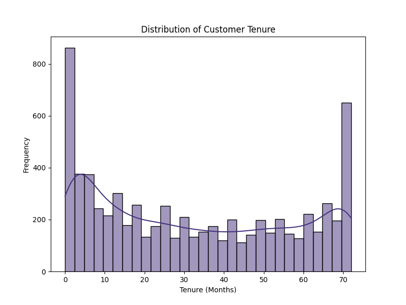
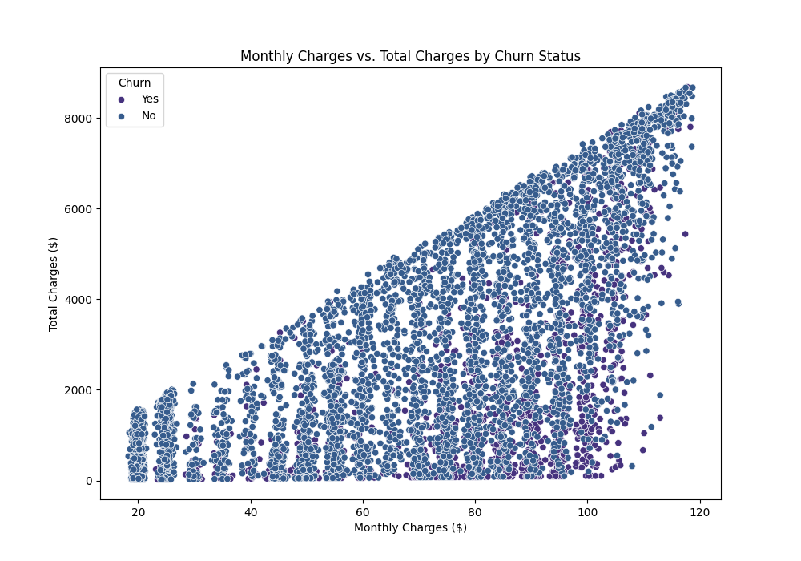
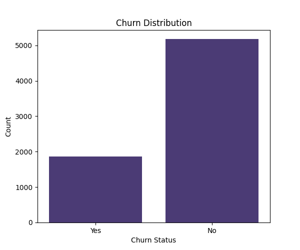
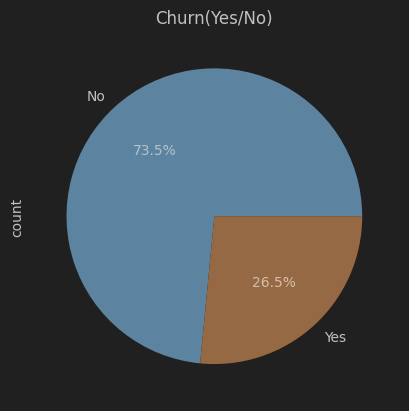
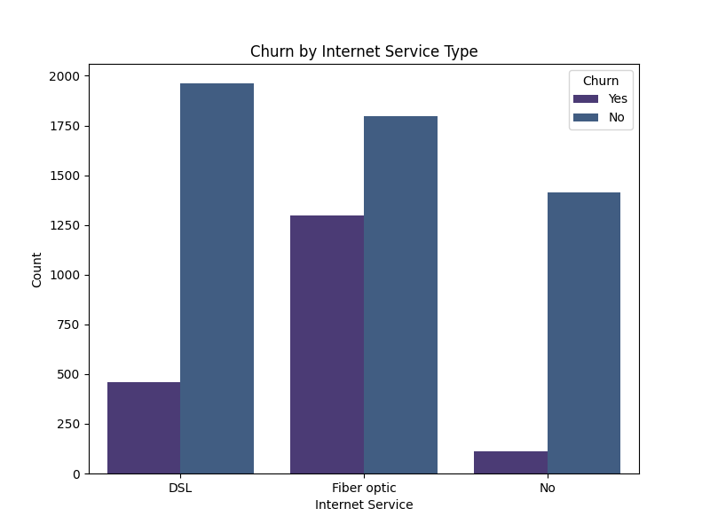
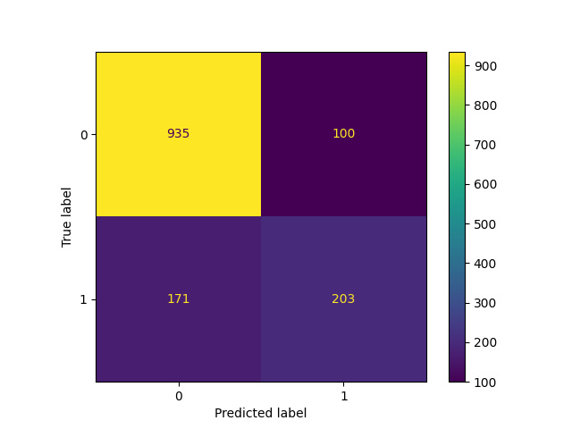

# 📊 Customer Churn Prediction  
**Project-3 | 90 Days Internship Program by GUVI/HCL**  

👨‍💻 **Developed by:** Subhash Kumar Rana  
📧 **Email:** [subhash_2312res664@iitp.ac.in](mailto:subhash_2312res664@iitp.ac.in)  

---

## 📝 Project Summary  
This project is a **comprehensive solution** for predicting **customer churn** in a telecom company.  
It covers the complete workflow:  
- 📂 **Data Preprocessing**  
- 🧠 **Model Training (Logistic Regression)**  
- 🌐 **Streamlit Web Application** for real-time predictions  
- 📈 **Exploratory Data Analysis (EDA)** for insights  

---

## 📷 Sample Outputs  

### 🔎 EDA Plots

<p align="center">
  
  
  
  
  
  
</p>

---

## 📁 Project Structure  

├── data_preprocessing.py # Data cleaning & preparation

├── train_model.py # Model training & saving as churn_model.pkl

├── predict.py # Load trained model & predict churn

├── app.py # Streamlit web app for real-time predictions

├── eda.py # Exploratory Data Analysis (EDA)

└── Telco_customer_churn.xlsx # Dataset (to be placed in root directory)

---


### 🔎 File Descriptions
- **`data_preprocessing.py`** → Loads raw data, drops unnecessary columns (e.g., location), handles missing values, and ensures correct data types.  
- **`train_model.py`** → Builds a pipeline using scikit-learn (imputation, scaling, one-hot encoding, Logistic Regression) and saves the trained model as `churn_model.pkl`.  
- **`predict.py`** → Loads the pre-trained model and predicts churn for new customers.  
- **`app.py`** → Streamlit-based web app with a simple form for real-time churn predictions.  
- **`eda.py`** → Generates insights and visualizations (e.g., churn distribution, tenure analysis, charges comparison). Saves plots in an **`eda_plots/`** directory.  

---
# 📊 Customer Churn Prediction  
**Project-3 | 90 Days Internship Program by GUVI/HCL**  

👨‍💻 **Developed by:** Subhash Kumar Rana  
📧 **Email:** [subhash_2312res664@iitp.ac.in](mailto:subhash_2312res664@iitp.ac.in)  

---

## 📝 Project Summary  
This project is a **comprehensive solution** for predicting **customer churn** in a telecom company.  
It covers the complete workflow:  
- 📂 **Data Preprocessing**  
- 🧠 **Model Training (Logistic Regression)**  
- 🌐 **Streamlit Web Application** for real-time predictions  
- 📈 **Exploratory Data Analysis (EDA)** for insights  

---

### 🌐 Streamlit Web Application 

<p align="center">
  
  
  
</p>

---
---

## 🚀 How to Run the Project  

### 1️⃣ Install Dependencies
```
pip install pandas scikit-learn streamlit matplotlib seaborn openpyxl
```

2️⃣ Place the Dataset

Ensure the file Telco_customer_churn.xlsx is in the project root directory.

3️⃣ Train the Model
```
python train_model.py
```

👉 This will generate churn_model.pkl (required for predictions).

4️⃣ Run the Web Application
```
streamlit run app.py
```

👉 Opens a user-friendly web interface for churn prediction.
